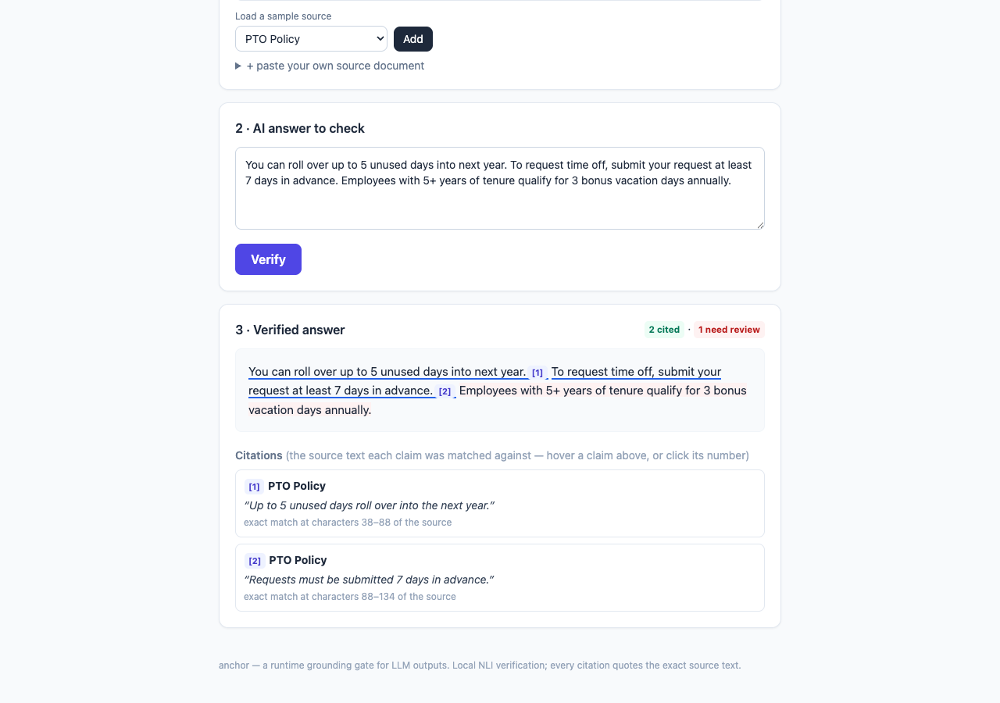
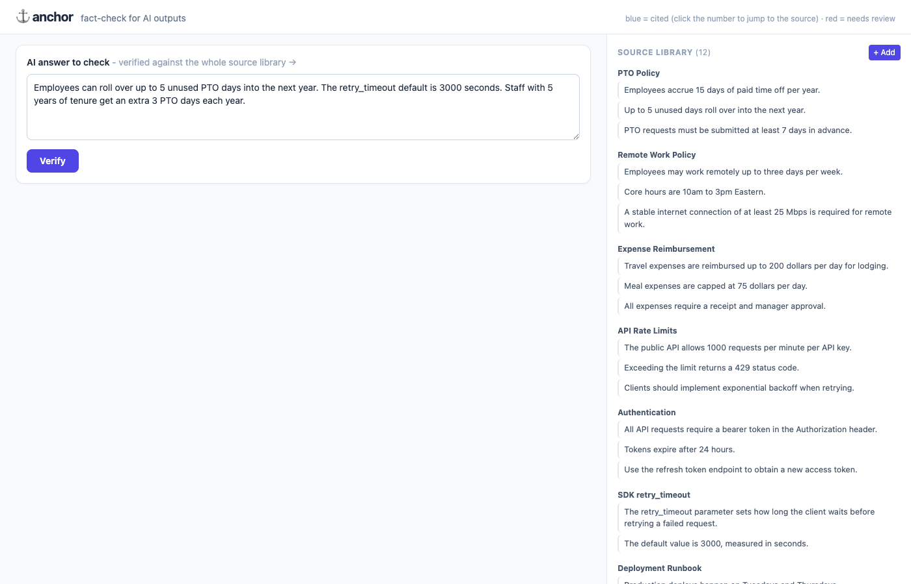

# anchor

**A runtime grounding gate for LLM outputs - catch hallucinated claims before they ship, with exact citations.**

Spell-check, but for facts. Give `anchor` an AI-generated answer and the source documents it should have drawn from: it splits the answer into atomic claims, verifies each against the sources, attaches an **inline citation** to every grounded claim (pointing to the exact `doc_id:start-end`), and flags the ones that aren't supported. **0.93 F1 on the FEVER public benchmark, fully local, no API.**

**Live demo:** https://anchor-production-44a7.up.railway.app/

## Screenshots

The playground highlights the answer in place - blue underline = cited (hover for the source), red underline = needs review:





## Usage in your code

```bash
pip install -e .          # anchor library + NLI core
```

```python
from anchor import Source, annotate, render_markdown

sources = [Source(id="policy", text="...the document the AI should have used...")]
answer  = "...the AI-generated answer..."

result = annotate(answer, sources)        # verifies each claim + cites
print(render_markdown(result))
# result.text       -> answer with inline [n] citations and warning flags
# result.citations  -> [{n, doc_id, start, end, snippet}, ...]
# result.flags      -> [claims not found in any source]
```

See [`examples/usage.py`](examples/usage.py) for a runnable version.

## Benchmark

**FEVER** (the standard public fact-checking benchmark - claim + gold evidence -> SUPPORTS/REFUTES, n=200):

| | accuracy | precision | recall | F1 |
|---|---|---|---|---|
| **anchor (NLI + lex + neg)** | **0.93** | 0.90 | **0.95** | **0.93** |

Plus a 27-case stress set (paraphrase, fabrication, numeric, negation, entity-swap, conditionals, multi-doc, dates/units):

| checker | acc | prec | recall | F1 |
|---|---|---|---|---|
| NLI-only | 0.85 | 0.82 | 1.00 | 0.90 |
| **NLI + lex + neg** | **0.96** | **0.95** | **1.00** | **0.97** |

## Examples & benchmarks

```bash
python examples/usage.py           # how to use anchor in your code
python examples/cite.py            # verify an AI answer against a source doc
python benchmarks/eval.py          # the stress-test eval (precision / recall / latency)
python benchmarks/bench_fever.py   # the FEVER public benchmark
python benchmarks/bench.py         # benchmark on benchmarks/bench.json - or YOUR own dataset
```

### Playground UI

```bash
pip install -e .[app]              # adds fastapi + uvicorn
cd playground && uvicorn app:app --reload      # http://localhost:8000
```

**Already live:** https://anchor-production-44a7.up.railway.app/

Deploy your own to any container PaaS - see `Dockerfile` / `render.yaml`. The NLI model needs ~2 GB RAM; for a low-traffic demo, enable scale-to-zero so you don't pay while idle.

## Why

Telling an LLM *"only answer from the sources"* helps - but it doesn't **guarantee** or **prove** anything. The model still invents, and you can't show an auditor "this was grounded." `anchor` is the independent check **plus** the citation/audit trail.

- **vs RAGAS** - RAGAS grades your RAG pipeline *offline* over a test set. `anchor` checks a *live* output at runtime, per claim, with citations.
- **vs NeMo Guardrails** - NeMo is a broad behavioral-rails framework (Colang, an LLM call per rail). `anchor` is a focused, **cheap-first** grounding layer: local models, an audit trail, and the LLM judge only on the residue.

## How it works

Each claim is verified through a pluggable checker interface:

| checker | what it catches | cost |
|---|---|---|
| **NLIChecker** (DeBERTa) | paraphrase, binding/entity-swap, numeric, negation, conditionals | local, ~15 ms |
| **lex confirmer + negation gate** | clears paraphrase false-alarms; keeps "do **not** need vs **must**" flagged | pure Python, free |
| **LLMJudgeChecker** | clears the last false alarms (precision confirmer) | optional, your key |

The recommended core is **NLI + lex + neg**: NLI's entailment/contradiction are reliable; when NLI is unsure ("neutral"), a lexical confirmer clears paraphrases and a negation/antonym gate keeps opposites flagged. Every grounded claim returns an exact citation; every verdict appends to an append-only JSONL audit log.

## Project layout

```
anchor/                # the library package (importable: from anchor import ...)
examples/              # usage + citation demos
benchmarks/            # eval, bench, FEVER runner, sample cases
playground/            # FastAPI app + UI (separate [app] deps, thin layer over the library)
docs/                  # UI screenshots
pyproject.toml         # installable; deps + [app] extra
Dockerfile / render.yaml   # one-command container deploy
```

`anchor` is the **verification** layer, not a retriever - point it at your existing corpus (RAG retriever, Confluence, SharePoint, vector DB) and it verifies + cites.

## Roadmap

- [x] Citation layer - inline citations with exact `doc:start-end`
- [x] Local NLI core (DeBERTa) + lexical & negation confirmers
- [x] Public benchmark on FEVER (0.93 F1)
- [ ] Provider-agnostic + local judge (Ollama) for air-gapped deployments
- [ ] Human-in-the-loop gate (block / strip / flag-for-review)

## License

MIT
